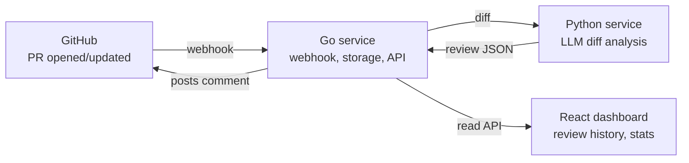

# PRSentry — AI-Powered Pull Request Review Assistant

## Project Objective
Manual code review is slow and inconsistent, especially on small teams without a dedicated senior reviewer. PRSentry automatically analyzes GitHub pull requests, flags bugs/style/security issues, and posts a structured review — cutting review turnaround time and catching problems before a human even opens the diff.

## AI Integration
Yes. An LLM analyzes each PR's code diff to detect bugs, security risks, and style violations, then generates a human-readable review summary with a risk score.
Stretch goal: embeddings to detect recurring issues across a repo's history.

## Key Features
- Automatic trigger on new/updated PRs via GitHub webhook
- AI-generated inline review comments + overall summary
- Risk/severity scoring per PR
- Dashboard showing review history, stats, and trends
- Configurable rules (e.g. ignore certain files, set severity thresholds)

## Technical Complexity
Intermediate–Advanced — webhook security, GitHub API integration, LLM prompting/structured output, and a live dashboard together push it past beginner scope, but each individual piece is manageable for a team of 3.

## Expected Duration
3 weeks (compressible to 2 with reduced scope).

---

## Architecture



Three independent services connected by a shared contract:
- **Go — the nervous system**: receives GitHub events, orchestrates the pipeline, stores results, exposes the API.
- **Python — the brain**: analyzes the diff and produces the structured review.
- **React — the face**: shows humans what happened.

Because each track only needs to agree on the shape of data crossing the boundary, all three can be built in parallel.

---

## Repository Structure

```
prsentry/
├── README.md
├── docker-compose.yml
├── .github/
│   └── workflows/
│       ├── go-ci.yml
│       ├── python-ci.yml
│       └── react-ci.yml
├── docs/
│   ├── api-contract.md        # shared JSON schemas — locked in Week 1
│   └── architecture.md
├── go-service/                # Person A
│   ├── go.mod
│   ├── cmd/server/main.go
│   ├── internal/
│   │   ├── webhook/           # GitHub signature verification, event parsing
│   │   ├── github/            # GitHub API client (fetch diff, post comment)
│   │   ├── store/             # DB layer (SQLite/Postgres)
│   │   └── api/               # REST endpoints for the dashboard
│   └── Dockerfile
├── python-service/            # Person B
│   ├── requirements.txt
│   ├── app/
│   │   ├── main.py            # FastAPI app, /review endpoint
│   │   ├── analysis.py        # diff chunking + LLM calls
│   │   └── schemas.py         # request/response models (Pydantic)
│   └── Dockerfile
└── react-dashboard/           # Person C
    ├── package.json
    ├── src/
    │   ├── App.tsx
    │   ├── pages/PRList.tsx
    │   ├── pages/ReviewDetail.tsx
    │   └── api/client.ts
    └── Dockerfile
```

Each service is independently runnable and dockerized. `docker-compose.yml` at the root spins up all three plus a database for local integration testing.

### Suggested branch strategy
- `main` — always deployable
- `go-service`, `python-service`, `react-dashboard` — long-lived integration branches per track, merged into `main` at each week's checkpoint
- Feature branches off each track branch for individual tasks

---

## Week-by-Week Build Plan

### Week 1 — Foundation + Contracts
**Together (Day 1):** Lock the shared JSON contracts in `docs/api-contract.md` — what a "diff analysis request" looks like going into Python, what a "review result" looks like coming out, and what endpoints Go exposes to React.

- **Person A (Go):** Webhook receiver, GitHub signature verification, register a GitHub App, return a mock "received" response.
- **Person B (Python):** FastAPI/Flask service with `/review` endpoint returning mock review JSON matching the contract; one real LLM call on a single test diff.
- **Person C (React):** Dashboard skeleton with mock data — PR list, review detail view, layout/routing.

*Checkpoint:* All three services run locally and talk in mock mode.

### Week 2 — Core Functionality
- **Person A:** Fetch real PR diffs from GitHub's API, store PRs/reviews in a DB, call Person B's service, post the result back as a real PR comment.
- **Person B:** Replace mock logic with real diff analysis — chunk large diffs, extract structured findings (bugs, style, security, summary, risk score).
- **Person C:** Connect the dashboard to Person A's real API — live PR list, review detail, filtering/search.

*Checkpoint:* Full pipeline works end-to-end on one real test repo.

### Week 3 — Polish + Hardening
- **Person A:** Error handling/retries, rate limiting, webhook security hardening, Dockerize, deploy.
- **Person B:** Improve prompt quality, configurable severity thresholds/ignore rules, cache repeated LLM calls to control cost.
- **Person C:** Stats/trends view, review comment previews, basic auth, responsive polish.

*Final 2-3 days (together):* End-to-end testing on a real open-source repo, README + architecture diagram, demo prep.
